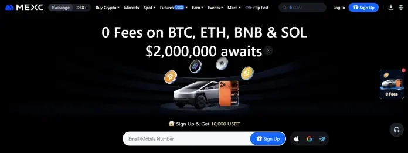
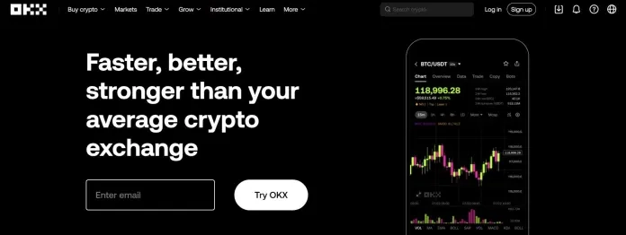
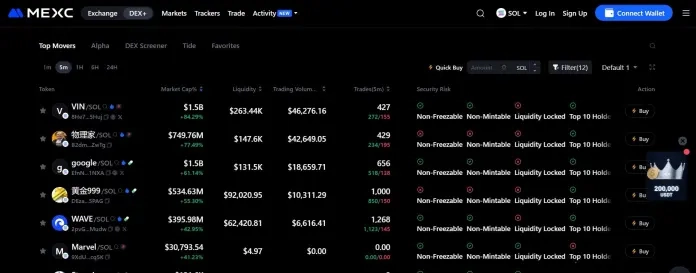
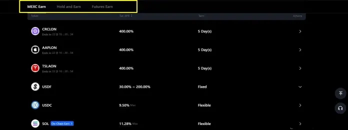
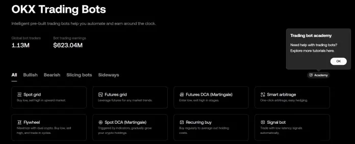
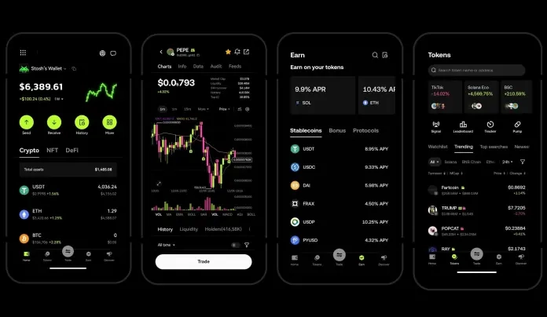

# MEXC vs OKX：哪个加密货币交易所更适合你的交易需求？

---

MEXC和OKX都是面向全球用户的加密货币交易所，提供现货、合约以及各类基础和进阶交易工具。但你可能会问：既然它们提供的产品差不多，我该选哪个？别急，这篇文章会把两家交易所的关键特性、费用结构、优缺点、安全措施等一一摆出来，帮你找到更适合自己的那一个。

---

## MEXC是什么？

MEXC成立于2018年，是一家全球性的加密货币交易所。虽然创始人信息比较低调，但运营团队在区块链技术、金融和网络安全领域都有丰富经验。

这个平台提供的服务挺全面：现货交易、合约、杠杆交易、新币发行平台(Launchpad)、模拟交易和质押等等，用户可以交易超过3000种数字资产和交易对。MEXC的高性能交易引擎每秒能处理140万笔交易，这速度在行业里算是相当能打的。

交易者选择MEXC的原因还包括它极低的交易费用、深度流动性，以及对新兴代币的早期上币承诺。这也是为什么MEXC能在全球170多个国家吸引超过4000万用户，每日交易量达到60亿美元以上（数据来自CoinMarketCap）。

### MEXC的优缺点

**优点：**
- 加密货币种类丰富，包括许多新兴和热门代币
- 现货和合约市场的交易费用都很低
- 注册流程快速，只需邮箱和密码就能开始
- 合约交易提供高达500倍的杠杆选项
- 交易执行速度快，流动性深
- 频繁上新币，经常有促销活动

**缺点：**
- 与大型交易所相比，法币入金选项较少
- 对新手来说，界面可能显得复杂，特别是考虑到平台提供的产品种类繁多
- MEXC在某些地区受限，包括美国

### MEXC适合谁？

- 想要交易各种加密货币和新上市代币的交易者
- 需要高杠杆（最高500倍）和高级交易工具的合约和衍生品交易者
- 希望享受低交易费用的新手和大额交易者
- 需要友好界面和专业级功能的各类交易者

👉 [立即注册MEXC，领取高达10,000 USDT新人福利](https://www.okx.com/join/62834398)

## OKX是什么？

OKX的前身是OKEx，由徐明星在2017年创立，总部位于塞舌尔。这个平台提供的不只是基础交易服务，还包括现货交易、合约、永续合约、期权和DeFi产品。

OKX是全球使用最广泛的加密货币交易所之一，服务覆盖100多个国家的数百万用户,每日交易量超过50亿美元（数据来自CoinMarketCap）。

虽然OKX也提供交易机器人、现货交易和衍生品产品，但真正让它脱颖而出的是强大的交易基础设施、多链钱包，以及通过OKX钱包和OKX链等产品对Web3开发的承诺。

### OKX的优缺点

**优点：**
- 高级交易工具和专业级界面
- 强大的安全基础设施和透明的运营
- 产品线广泛，包括现货、合约、期权和DeFi
- 集成Web3钱包和多链生态系统
- 具有竞争力的交易费用和高流动性
- 拥有自己的原生区块链（X Layer），确保更快、更便宜的交易

**缺点：**
- 不向美国用户提供服务
- 高峰时段可能出现较高的网络费用
- 法币交易选项有限
- 复杂的高级功能可能让新手感到困惑

### OKX适合谁？

- 寻求高级交易工具、衍生品产品和深度流动性的专业和机构交易者
- 想要通过OKX钱包探索去中心化应用、质押和NFT的DeFi和Web3爱好者
- 寻找储蓄、质押和双币投资等多样化收益机会的投资者
- 希望获得现货、合约和被动收入产品一站式平台的新手，以及需要访问web3生态系统和强大教育支持的用户

## MEXC vs OKX：平台产品和服务

MEXC和OKX都有一些让它们适合不同交易者的关键特性。咱们详细看看。

### MEXC提供什么：

- **高杠杆**：MEXC在某些合约上提供高达500倍的杠杆选项，让交易者可以放大他们的仓位和潜在利润
- **DEX+**：这是MEXC的去中心化交易所集成功能，允许用户直接从钱包交易，同时保持对资产的控制。DEX+结合了DeFi的安全优势和中心化平台的流动性与速度

- **MEXC Launchpad和Launchpool**：Launchpad帮助新区块链项目向市场推介他们的代币。通过MEXC launchpool，交易者可以参与早期代币销售，在项目上市前就能接触到有前景的新项目
- **MEXC Earn**：提供锁仓和活期储蓄产品，让用户通过闲置的加密货币赚取被动收入。活期储蓄可以随时提取，而锁仓储蓄为承诺固定期限的用户提供更高的回报

### OKX提供什么：

- **交易机器人**：OKX提供自动化交易机器人，帮助用户根据预设策略执行交易，无需持续手动监控。包括现货网格机器人、合约网格机器人、定投(DCA)机器人和套利机器人

- **OKX Earn**：提供一系列产品，包括储蓄和质押、加密货币贷款，以及访问链上借贷市场。你可以选择活期或定期来赚取持有资产的利息，质押代币获取网络奖励，或将资产借给借款人以获得额外收益
- **OKX钱包**：OKX钱包是一个自托管的多链钱包，允许用户安全地存储、交易和管理他们的加密货币和NFT。它支持30多条区块链上的数千种代币，使用户能够直接访问DeFi平台、dApp和Web3游戏

- **Jumpstart**：OKX Jumpstart是平台的代币发行平台,允许用户参与早期区块链项目。它通过质押OKB（OKX的原生代币）让用户获得新代币销售或空投的机会

值得一提的是，MEXC和OKX都提供机构级工具和解决方案,服务对象包括对冲基金、资产管理公司和专业交易者。这些服务包括高级API、定制化API访问、深度流动性池、专属客户经理和场外交易(OTC)。

## MEXC vs OKX：费用结构对比

| 费用类型 | MEXC | OKX |
|---------|------|-----|
| **现货交易（挂单/吃单）** | 0.0000% / 0.0500% *持有MX代币可享高达50%折扣* | 0.080% / 0.100% *通过VIP等级可获折扣* |
| **合约交易（挂单/吃单）** | 0.000% / 0.020% | 0.020% / 0.050% |
| **充值费用** | 免费 | 免费 |
| **提现费用** | 因代币和网络而异 | 因代币和网络而异 |
| **零费用交易对** | 有 | 有 |
| **优惠折扣** | 持有500+个MX代币可享高达50%费用折扣。MX代币"抵扣"还可享20%折扣 | 基于30天交易量和OKB持有量的分级折扣 |

## MEXC vs OKX：支持的币种、流动性和交易量

| 对比项 | MEXC | OKX |
|--------|------|-----|
| **支持币种** | 3,000+ | 400+ |
| **交易对** | 2,000+对（现货和衍生品合计） | 500个现货对和400+衍生品对 |
| **市场流动性** | 主要交易对流动性深厚，部分小币种流动性相对较弱 | 流动性深厚，特别是主要交易对。还为机构/大宗交易提供流动性市场以减少滑点 |
| **24小时交易量（CMC数据）** | $6,441,204,299 | $4,911,631,568 |

*注：以上数据为撰写时的实际数据。加密货币市场交易量和流动性因市场波动和交易活动频繁变化。在做出任何交易决策前，请直接在各交易所网站或加密货币追踪软件上验证最新数据。*

## MEXC vs OKX：安全性对比

MEXC和OKX都非常重视安全,实施了强大的安全措施来保护用户资产。

### MEXC的安全措施

- **冷存储**：大部分用户资金存储在离线冷钱包中，最大程度减少在线威胁的暴露
- **双因素认证(2FA)**：通过Google Authenticator或短信验证为登录和提现添加第二层保护
- **安全保险基金**：MEXC推出了1亿美元的"守护者基金"，旨在为用户提供针对重大安全漏洞、技术故障和其他严重事件的保护。该基金在链上公开披露，因此其余额和交易都是透明的
- **合约保险基金**：交易所的合约保险基金（用于衍生品/清算风险）超过5.4亿美元,用于在用户清算超过其保证金时覆盖损失，处理"负余额"事件

### OKX的安全措施

- **冷存储**：OKX将95%的用户资金离线存储在高度安全的、与网络隔离的冷钱包中,采用加密私钥和多重签名批准流程来处理任何资金转移
- **账户安全**：用户账户受益于强制性的双因素认证(2FA)和提现地址白名单，在向新地址发送资金之前需要预先批准
- **AI驱动的威胁检测**：在OKX Eagle Eye计划下扫描欺诈活动、深度伪造和虚假账户
- **半离线多设备授权**：OKX将其私钥存储在多个未连接互联网的安全设备上（半离线）。这些设备使用加密通信渠道离线签署交易，这意味着私钥本身永远不会离开其受保护的环境或在线暴露

👉 [体验OKX的银行级安全保障，开启安全交易之旅](https://www.okx.com/join/62834398)

## MEXC vs OKX：推荐计划

MEXC和OKX都提供推荐奖励计划,让用户通过邀请朋友获得佣金和奖励。MEXC的推荐计划提供终身佣金分成，推荐人可以从被推荐人的交易费用中赚取高达60%的佣金。OKX的推荐计划同样慷慨，为推荐人提供高达40%的佣金分成和各种奖励。

*专业提示：使用邀请码62834398注册，可解锁高达10,000 USDT的欢迎奖励。*

## MEXC vs OKX：用户体验

根据我们的使用体验，MEXC的注册流程快速直接。你只需要邮箱或手机号码和密码就可以注册。虽然完成KYC认证不是强制性的，但认证用户可以获得更高的提现限额。

移动应用与网页平台的功能相同,支持现货和衍生品交易，虽然与OKX相比，界面可能感觉稍微有些拥挤。MEXC的交易界面包括标准订单类型、TradingView图表和高级图表工具。用户还可以访问模拟交易、法币入金和理财产品。

另一方面，OKX有更结构化的注册流程，包括KYC和额外的安全设置，这使得它比MEXC稍慢一些，但更合规。界面现代且最近进行了升级,提供多种模式：简单模式、高级模式和Web3模式。iOS和Android的移动应用稳定、响应迅速，与MEXC移动应用相比设计更精良。

OKX的交易界面提供高级订单类型、深入的分析以及用于衍生品的综合工具，包括保证金、合约和期权。它还提供自动化交易机器人、理财产品、Web3钱包集成、法币入金和跨链功能。

## MEXC vs OKX：客户支持

MEXC提供**7×24小时客户支持**，通过在线聊天、电子邮件和工单系统，聊天响应时间通常在几分钟内,电子邮件咨询在24-48小时内答复。它的帮助中心提供详细的交易指南、安全资源和API文档，并有活跃的地区性Telegram社区提供非正式协助。它也是最语言友好的交易所之一,在主要地区支持超过40种语言。

同样，**OKX提供7×24小时支持**，通过聊天和工单，以及全面的帮助中心。用户可以从自动回复开始，然后升级到真人客服,聊天的平均等待时间为几秒钟，工单约为10-15分钟。

该交易所提供关于交易、安全和平台导航的清晰文档,以及产品教程。OKX目前支持约15种主要语言,让全球交易者在需要时都能轻松获得帮助。

## 总结

MEXC和OKX提供强大的交易和去中心化生态系统,以不同方式服务交易者。如果你想探索新代币和高杠杆交易，MEXC提供基础和高级交易工具，以及强大的代币发行平台，帮助你在新项目公开发售前就能参与其中。

然而，如果你的重点是大额衍生品交易和流畅的导航体验，OKX是更均衡的选择。说到底，最好的平台是符合你目标和交易风格的那一个，所以花点时间去探索它们的工具吧。

## 常见问题

### 有比MEXC更好的交易所吗？

要确定哪个交易所比MEXC更好，重要的是考虑交易费用、交易对、流动性、安全性、用户体验和监管合规等因素。MEXC的主要替代品包括OKX、Binance、Bybit、Bitget和Coinbase。

### MEXC和OKX哪个手续费更低？

MEXC的费用比OKX低。虽然两家交易所都收取低费用并提供零费用交易对，但MEXC收费更少,使其成为加密货币市场交易成本最低的交易所之一。

### MEXC和OKX哪个对新手更友好？

MEXC对新手更友好。虽然两家交易所都为新手提供各种基本功能，但我们认为MEXC更适合新手，因为它的界面易于使用、教育内容丰富、费用低且币种选择多。

### MEXC和OKX哪个更安全？

两家交易所都实施了强大的安全措施来保护用户资产。MEXC和OKX都将大部分用户资产存储在冷/离线钱包中，采用多重签名批准,鼓励各种账户安全措施。此外，它们都有保险基金,在发生漏洞时向交易者提供补偿。

### MEXC和OKX哪个更适合高级交易者？

OKX更适合高级交易者。OKX和MEXC都提供适合资深交易者的产品和平台，但OKX对于专业衍生品交易者来说是更强的选择。
